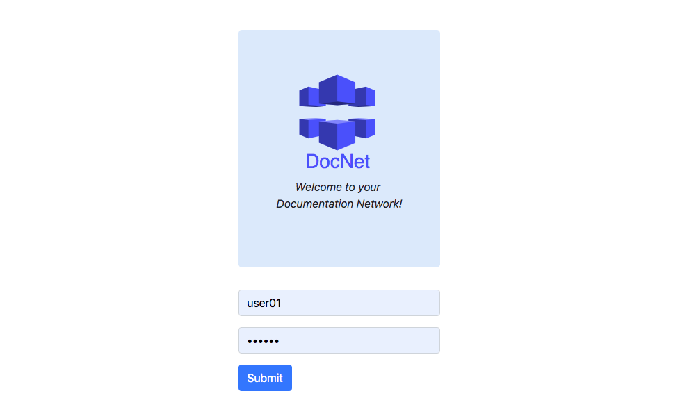
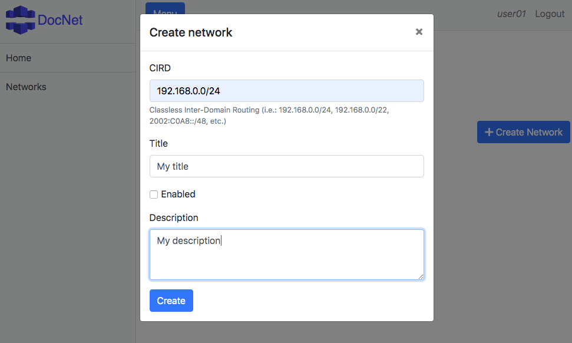
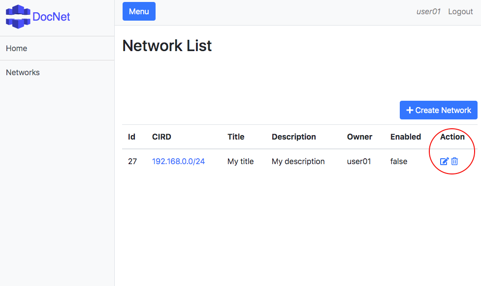
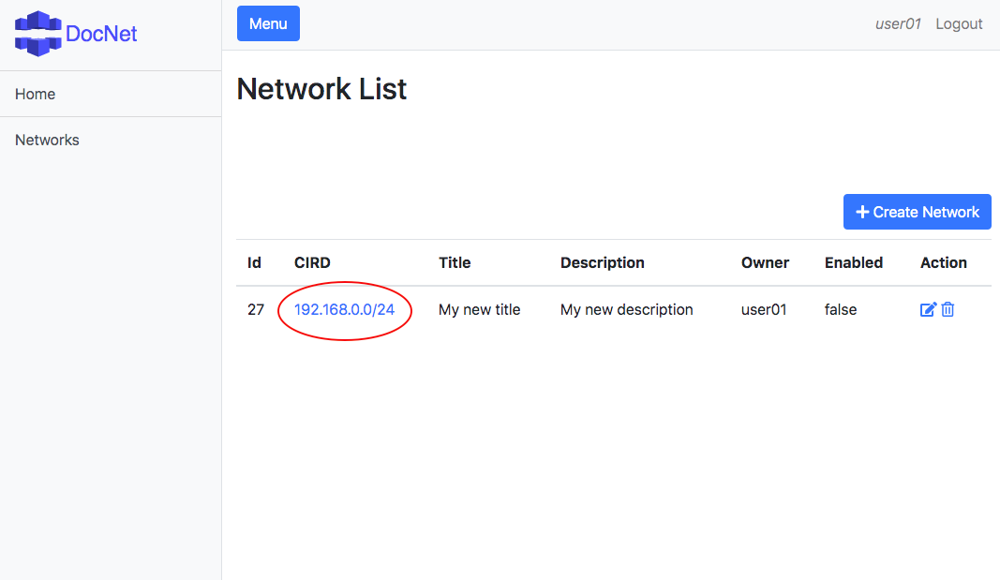
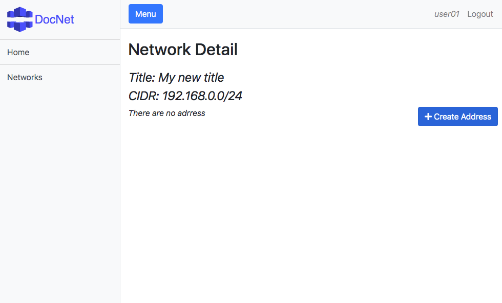
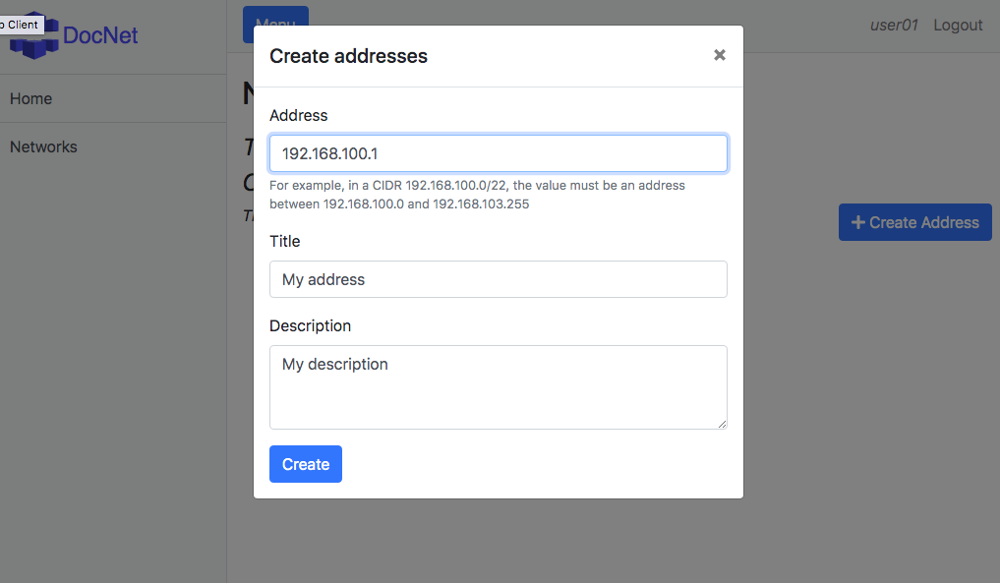
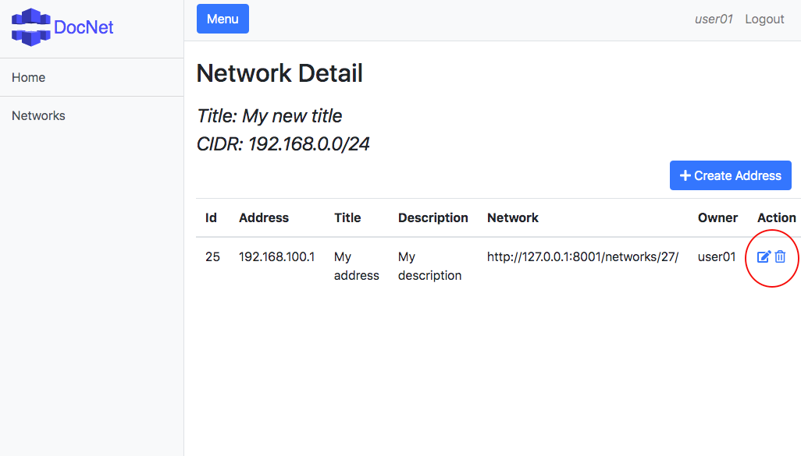

#1. Introduction

DocNet is a system for network documentation. The system are composed by a web server and a web client. 
The web server was implemented in Python in Django REST Framework.
The web client was implemented in AngularJS in Node.js.
The both deploy was prepared to be launched in Docker containers each, using Dockerfile and docker-compose.

The features offered by the system are:
* User authentication through login and password (the web client control it using cookies and Django tokens)
* Create, read, update and delete a network
* Create, read, update and delete an address for a network
* Search search an network 


#2. Install 

#### Get the code
```
git clone https://github.com/Malinoski/telecon-docnet telecon-docnet
cd telecon-docnet
```

#### Deploy the web server 

```
cd docnet-webserver
docker-compose up -d 
```

http://localhost:8001

#### Deploy the web client

```
cd ..
cd docnet-webclient
docker-compose up -d
```

Available users (```$USERNAME:$PASSORD```): ```user01:user01``` and ```user02:user02```

http://localhost:8002 

#3. How to use

The following 8 steps illustrate how to create, edit, view and remove networks and address. 

_1. Access the web client at http://localhost:8001, and enter with the username ```user01``` and password ```user01```_


_2. You will see an empty list of networks. Lets create on the button "Create Network"_


_3. Set the desired values:_


_4. Now you can edit or remove the network on the action icons_
 

_5. Click on the hyperlink to create a new address:_


_6. Click on the button "Create Address":_


_7. Set the desired values:_


_8. Now you can edit or remove the address on the action icons_


#3. Uninstall

Just destroy the Docker containers

```
docker stop docnet-webserver; docker rm docnet-webserver; docker rmi docnet-webserver_web
docker stop docnet-webclient; docker rm docnet-webclient; docker rmi docnet-webclient_web
```