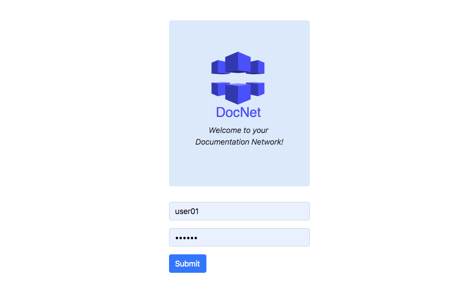
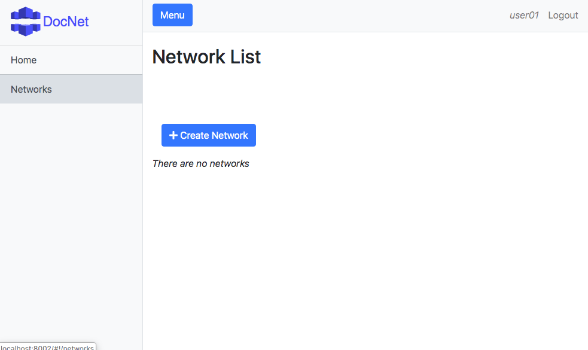
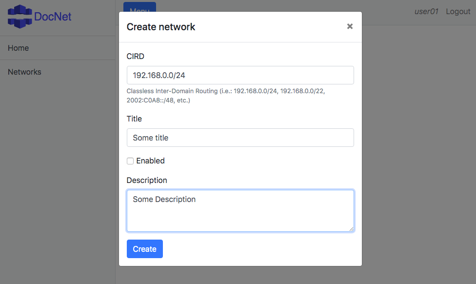
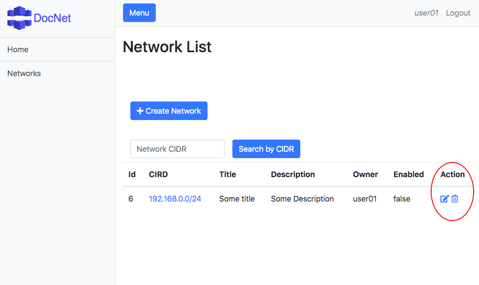
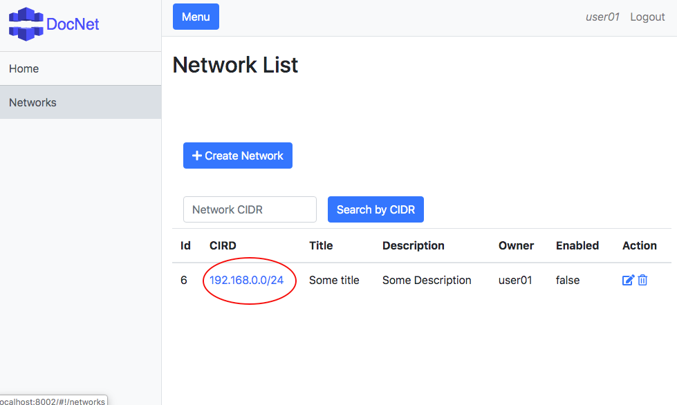
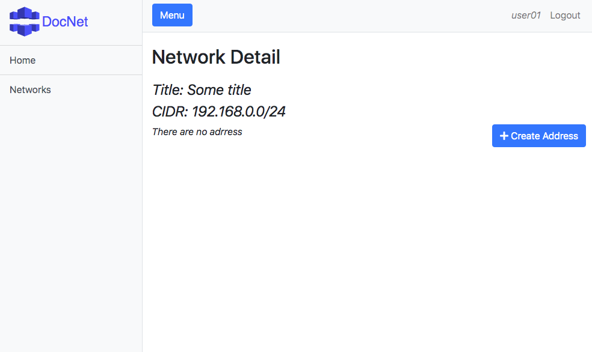
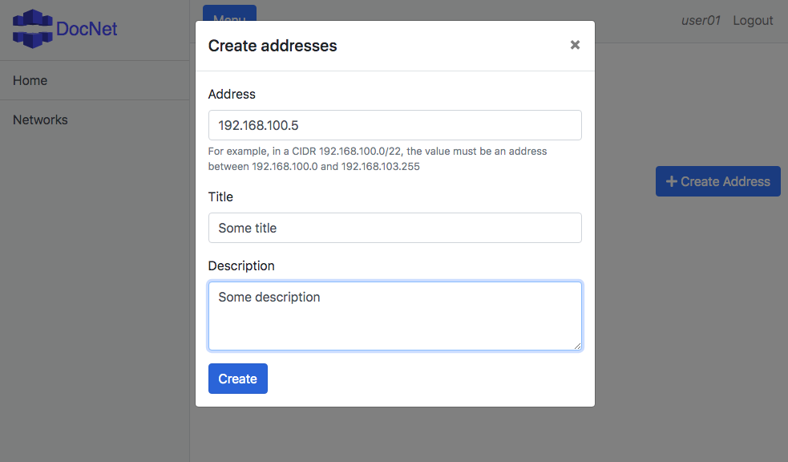
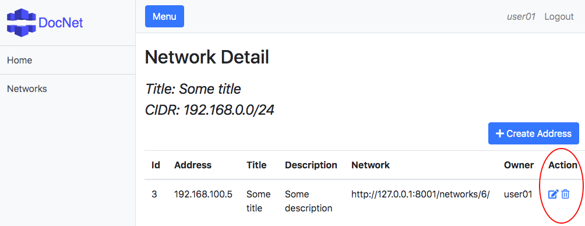
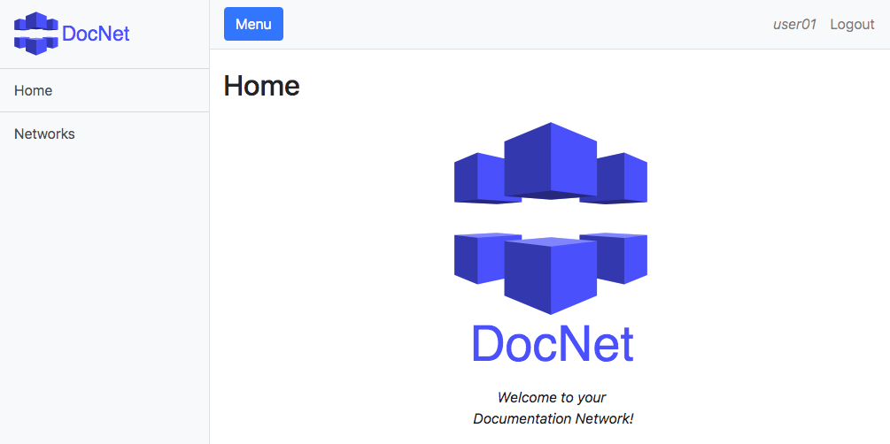

# 1. Introduction

DocNet is a system for network documentation. The system are composed by a web server and a web client. 
The web server was implemented in Python in Django REST Framework.
The web client was implemented in AngularJS in Node.js.
The both deploy was prepared to be automatically launched in Docker containers each, using Dockerfile and docker-compose.

The authentication roles are defined as:
* Only authenticated users can access the system
* Anyone can see all networks and address
* Anyone can create networks and address    
* Only owners can edit or delete their own networks or addresses  

Some good points:
* User authentication through login and password. This feature is controlled by browser cookies and Django tokens.
* Users can create, view, edit and delete networks and addresses
* Users can search for an existing network, considering a criteria
* Avoid overlapping networks
* Unit tests for all entities (Network and Address), considering HTTP requests for create, read, update and delete. These tests are executed automatically when the container starts.
* Automatic deploy for Web Server and for Web Client in containers Docker. 

Some bad point:
* Do not exist verification of network or address type (like IPv4 or IPv6). The fields are text based only
* Unit tests on the Web Client (Angular)
* The overlapping is performed on client side (Angular Web Client). This restriction must be done in server side (Web Server Django) 
* The web pages do not treat pagination
* All javascripts and CSS from third parties must be removed from source code. This must be automatically downloaded on the automatic deploy 

# 2. Install 

#### Get the code
```
git clone https://github.com/Malinoski/telecon-docnet telecon-docnet
cd telecon-docnet
```

#### Deploy the web server 

```
cd docnet-webserver
docker-compose up -d 
```

http://localhost:8001

#### Deploy the web client

```
cd ..
cd docnet-webclient
docker-compose up -d
```

Available users (```$USERNAME:$PASSORD```): ```user01:user01``` and ```user02:user02```

http://localhost:8002 

# 3. How to use

The following steps illustrates the basic of create networks and addresses. 

_1. Access the web client at http://localhost:8002, and enter with the username ```user01``` and password ```user01```_


_2. Lets create a networks by clicking on button "Create Network"_


_3. Insert some values for your network:_


_4. Now you can edit or remove on the action icons_
 

_5. Click on the hyperlink to create a new address:_


_6. And click on the button "Create Address":_


_7. Insert some values for your address_


_8. Now you can edit or remove on the action icons_


_9. This was the basic on create networks and address


# 4. Uninstall

Just destroy the Docker containers

```
docker stop docnet-webserver; docker rm docnet-webserver; docker rmi docnet-webserver_web
docker stop docnet-webclient; docker rm docnet-webclient; docker rmi docnet-webclient_web
```
